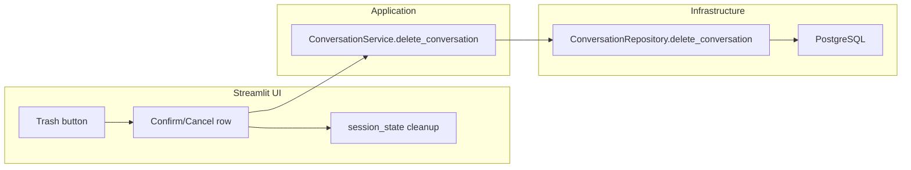

# Enable Conversation Deletion in UI

## Current State

- **Repository**: [`delete_conversation`](src/chat_buddy/infrastructure/db/repositories/conversation_repository.py) already exists and is tested (cascade deletes messages via SQLAlchemy relationship on [`Conversation.messages`](src/chat_buddy/infrastructure/db/models/conversation.py)).
- **Service**: [`ConversationService`](src/chat_buddy/application/service/conversation_service.py) has no delete method yet.
- **UI**: [`render_conversation_row`](src/chat_buddy/ui/streamlit_app.py) already reserves a delete column but renders `st.empty()` as a placeholder (lines 138–139).



## Implementation

### 1. Add service method

In [`conversation_service.py`](src/chat_buddy/application/service/conversation_service.py), add a thin delegate mirroring `rename_conversation`:

```python
def delete_conversation(self, conversation_id: UUID) -> bool:
    return self._repository.delete_conversation(conversation_id=conversation_id)
```

- Returns `True` if deleted, `False` if not found.
- No extra business logic needed (unlike rename, which normalizes title text).

### 2. Add two-step delete confirm UI

Follow the same row-mode pattern used by rename (`editing_conversation_id`).

**New session state key:** `confirming_delete_conversation_id: UUID | None`

**New helper:** `render_delete_confirm(conversation_service, conversation)` in [`streamlit_app.py`](src/chat_buddy/ui/streamlit_app.py):
- Show compact prompt, e.g. `Delete "{title}"?`
- **Confirm (✔)**: call `conversation_service.delete_conversation(...)`, then:
  - If deleted id == `st.session_state.conversation_id`, set `conversation_id = None`
  - Clear `confirming_delete_conversation_id` and `editing_conversation_id`
  - `st.rerun()`
- **Cancel (✖)**: clear `confirming_delete_conversation_id`, `st.rerun()`
- On `False` return: `st.toast("Conversation not found.")` and clear confirm state

**Update `render_conversation_row`:**
1. If `confirming_delete_conversation_id == conversation.id` → render delete confirm (same priority tier as edit mode)
2. Replace `st.empty()` with trash button (🗑️, `help="Delete conversation"`) that sets `confirming_delete_conversation_id` and clears `editing_conversation_id`
3. When entering rename mode, clear `confirming_delete_conversation_id` (mutual exclusion)

**Update `render_sidebar`:**
- On "+ New Chat", also clear `confirming_delete_conversation_id`

### 3. Session state after delete

When the deleted conversation was the active one, set `conversation_id = None` so the main chat area goes blank until the user selects or creates another conversation. Do not auto-select the next conversation (keeps behavior predictable and diff small).

## Files to Change

| File | Change |
|------|--------|
| [`conversation_service.py`](src/chat_buddy/application/service/conversation_service.py) | Add `delete_conversation` |
| [`streamlit_app.py`](src/chat_buddy/ui/streamlit_app.py) | Confirm UI, trash button, session-state handling |

## Testing

- **Manual**: In Streamlit sidebar, click 🗑️ → confirm → conversation disappears; if it was selected, main chat clears. Cancel restores normal row. Rename and delete modes do not overlap.
- **Automated**: No new tests required — repository delete is already covered in [`tests/infrastructure/db/test_conversation_repository.py`](tests/infrastructure/db/test_conversation_repository.py), and the service method is a one-line delegate (consistent with untested `rename_conversation`).

## Out of Scope

- Memories are global (not tied to conversations), so no memory cleanup is needed on delete.
- No `st.dialog` modal; inline row confirm matches existing rename UX.
