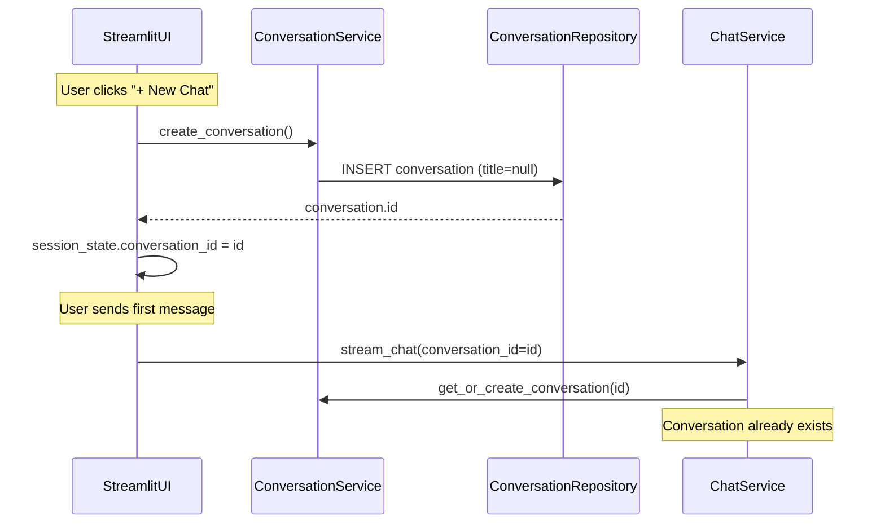
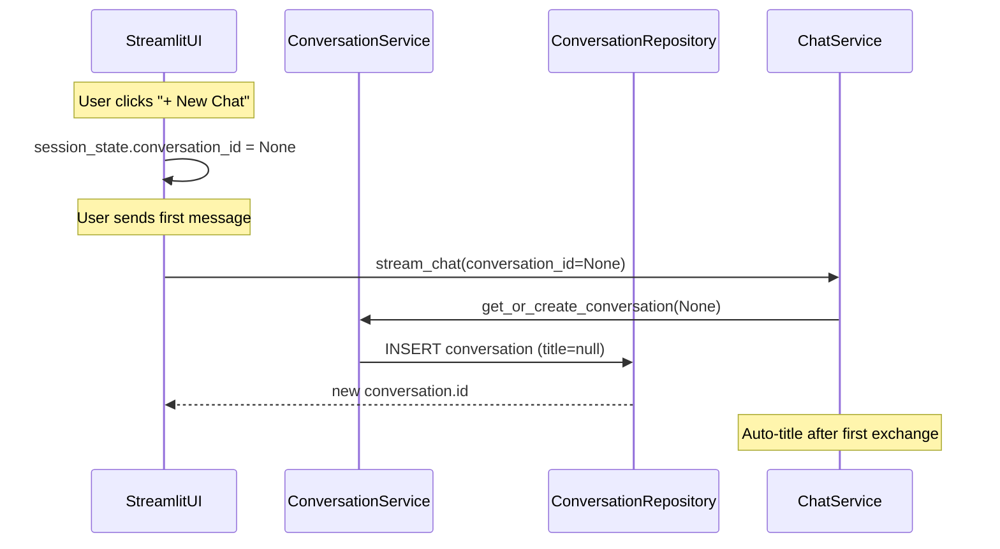

# Ephemeral New Conversations and Default Title

## Current Behavior



- [`streamlit_app.py`](src/chat_buddy/ui/streamlit_app.py) line 191: "+ New Chat" calls `conversation_service.create_conversation()`, which immediately inserts a row via the repository.
- Untitled conversations display `Conversation {uuid[:8]}` in the sidebar (lines 105, 157).
- [`ChatService.stream_chat`](src/chat_buddy/application/service/chat_service.py) already calls `get_or_create_conversation(conversation_id=None)` when no conversation is selected, which creates the row on first message — no change needed there.

## Target Behavior



- Clicking "+ New Chat" clears the active conversation without touching the database.
- A conversation row is created only when the user sends their first message.
- Sidebar rows with `title=None` show **"New Conversation"** instead of an abbreviated UUID (brief window before LLM auto-title runs after the first exchange).

## Implementation

### 1. Make "+ New Chat" ephemeral — [`streamlit_app.py`](src/chat_buddy/ui/streamlit_app.py)

Replace the create call in `render_sidebar`:

```python
# Before
conversation = conversation_service.create_conversation()
st.session_state.conversation_id = conversation.id

# After
st.session_state.conversation_id = None
```

Keep clearing `editing_conversation_id` and `confirming_delete_conversation_id` as today.

**Result:** Fresh app load (`conversation_id=None`) and "+ New Chat" behave the same — blank chat area, no empty DB rows abandoned by users who never send a message.

### 2. Default title display — [`streamlit_app.py`](src/chat_buddy/ui/streamlit_app.py)

Add a module-level constant:

```python
DEFAULT_CONVERSATION_TITLE = "New Conversation"
```

Replace both fallbacks in `render_delete_confirm` and `render_conversation_row`:

```python
# Before
title = conversation.title or f"Conversation {str(conversation.id)[:8]}"

# After
title = conversation.title or DEFAULT_CONVERSATION_TITLE
```

No repository or service changes required for this — the abbreviated UUID exists only in the UI layer. Auto-title logic in [`chat_service.py`](src/chat_buddy/application/service/chat_service.py) (`if is_first_exchange and not conversation.title`) continues to work because DB `title` remains `null` until the first exchange completes.

### 3. No changes to repository or service layer

| File | Action |
|------|--------|
| [`conversation_repository.py`](src/chat_buddy/infrastructure/db/repositories/conversation_repository.py) | No change |
| [`conversation_service.py`](src/chat_buddy/application/service/conversation_service.py) | No change — `create_conversation()` stays for integration tests and programmatic use; `get_or_create_conversation(None)` already handles deferred creation on first message |

**Do not** set a default title at DB creation time — that would prevent auto-title from running (`not conversation.title` would be false).

## Files to Change

Only [`src/chat_buddy/ui/streamlit_app.py`](src/chat_buddy/ui/streamlit_app.py) — ~5 lines changed.

## Testing

**Manual (Streamlit):**
1. Click "+ New Chat" → main chat clears; sidebar list unchanged (no new empty row).
2. Send a message → conversation appears in sidebar; auto-title applied after response.
3. Click "+ New Chat" again without sending → no new DB row.
4. Existing conversation with `title=null` (if any) shows "New Conversation" in sidebar, not a UUID prefix.

**Automated:** Existing tests unaffected — integration tests call `create_conversation()` directly to seed state, which remains valid.
